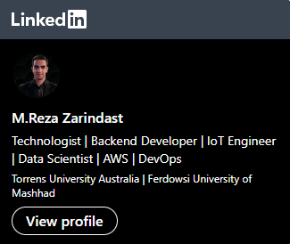

I’m Reza Working from home and I love open-source project collaboration.

**If you're interested in DevOps and Data analysis Here's my discord channel you can join me:**

<!---
R-Goldenhand/R-Goldenhand is a ✨ special ✨ repository because its `README.md` (this file) appears on your GitHub profile.
You can click the Preview link to take a look at your changes.
--->
